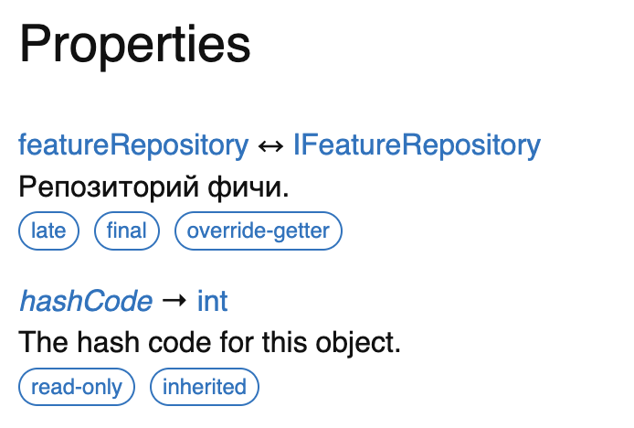
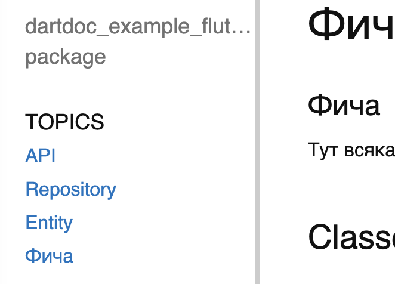
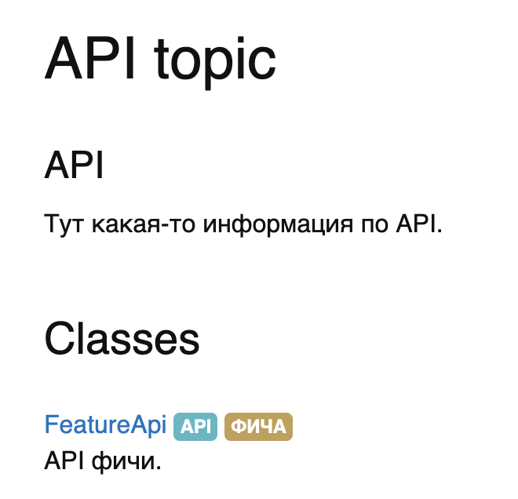
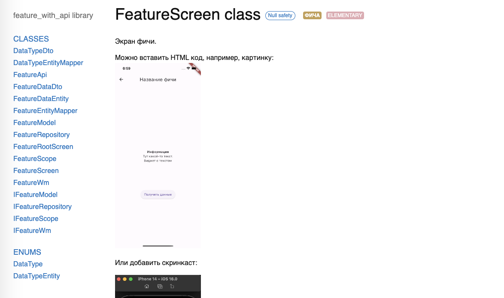
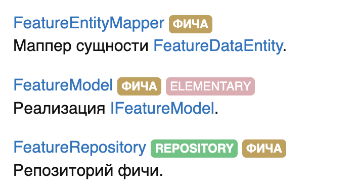
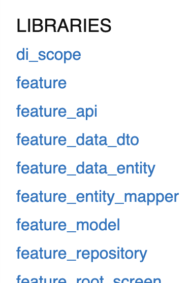
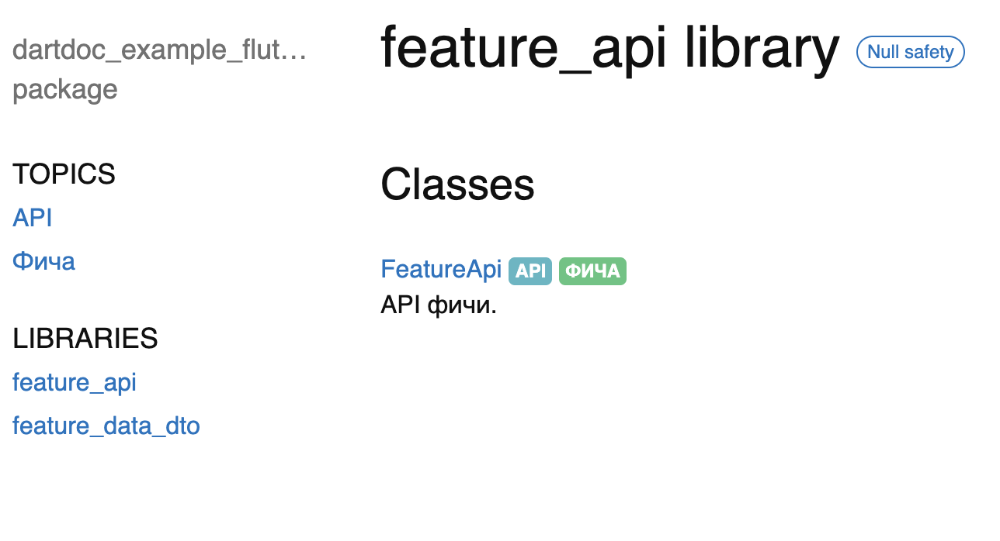
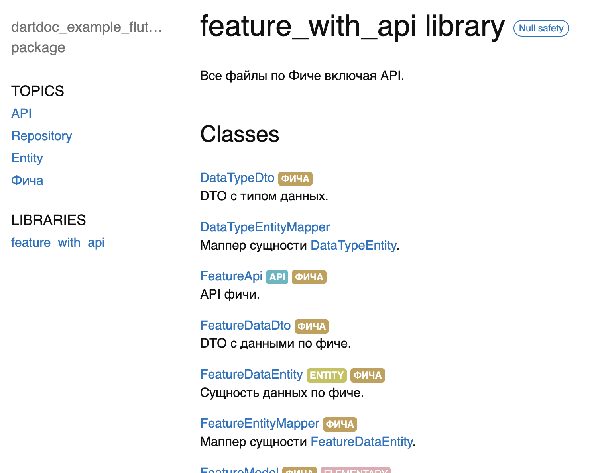

# Пример использования dartdoc для Flutter приложения

## Правильное документирование кода
Прежде всего, для того чтобы получить хорошую документацию, нужно правильно комментировать код.

Как оставлять комментарии в коде можно почитать [тут](https://dart.dev/language/comments).
Рекомендации по документированию описаны в статье [Effective Dart: Documentation](https://dart.dev/guides/language/effective-dart/documentation).

Не буду описывать все рекомендации, но остановлюсь на первой.

> DO format comments like sentences.

Благодаря тому, что комментарий выглядит как предложение (с точками в конце 😎), мы получаем документацию в едином стиле:

<object data='assets/comments_1.png' width="300">
    
</object>

## Дополнительные возможности документирования через теги в комментариях

Помимо простого текста в комментариях можно использовать теги, которые будут определенным образом интерпретированы при генерации документации.
Рассмотрим основные.

#### @category
Этот тэг позволяет отнести элемент кода (класс, метод, переменную) к какой-либо категории. На странице документации категории отображаются в виде списка в разделе TOPICS:

<object data='assets/tags_1.png' width="300">
    
</object>

При нажатии на ссылку открывается страница категории и список всех элементов, которые помечены этой категорией:

<object data='assets/tags_2.png' width="300">
    
</object>

Также, как видно, элементы помечаются ярлыком указанной для них категории. При клике на ярлык опять же открывается страница категории.

Можно добавлять несколько категорий:
```dart
/// {@category API}  
/// {@category Фича}  
@RestApi()  
abstract class FeatureApi {
...
```

Также существует тег `@subCategory`, но пока он бесполезен, есть предложение использовать его для организации структуры в разделе TOPICS, но пока не реализовано ([ссылка на issue](https://github.com/dart-lang/dartdoc/issues/2954)).

#### @template, @endtemplate и @macro
Эти теги позволяют прописать комментарий один раз и далее в коде использовать ссылку на него.

Проще разобрать синтаксис на примере.
У нас есть сущность `FeatureDataEntity`, которая содержит другую сущность `DataTypeEntity`. В этом случае можно воспользоваться шаблоном:
```dart
/// Сущность данных по фиче.  
/// {@category Entity}  
/// {@category Фича}  
@freezed  
class FeatureDataEntity with _$FeatureDataEntity {  
  /// @nodoc.  
  const factory FeatureDataEntity({  
    /// Данные.  
    required String data,  
  
    /// {@macro data_type_entity}  <---- используем шаблон
    required DataTypeEntity dataType,  
  }) = _FeatureDataEntity;  
}  
  
/// {@template data_type_entity}  
/// Сущность типа данных.  
/// {@endtemplate}  
/// {@category Сущности}  
enum DataTypeEntity {  
  /// Заголовок.  
  title('Заголовок'),
```

Также полезно для репозиториев, например.
В самом репозитории пишем:
```dart
/// {@template feature_repository}  
/// Репозиторий фичи.  
/// {@endtemplate}  
/// {@category Repository}  
/// {@category Фича}  
class FeatureRepository implements IFeatureRepository {
...
```

А в описании зависимостей ссылаемся на шаблон:

```dart
/// DI скоуп фичи.  
/// {@category Фича}  
abstract class IFeatureScope {  
  /// {@macro feature_repository}  
  IFeatureRepository get featureRepository;  
  
  /// {@macro scope_dispose}  
  void dispose();  
}
...
```

#### @image и @animation
Эти теги позволяют добавлять в документацию картинки и видео.
Но есть проблемы:
- я не смог добиться отображения картинок через `@image` ,
- видео через `@animation` отображается, но надо точно указывать размеры, если хотите масштабировать, нельзя задать просто ширину, например.

Я пришел к выводу, что проще всего использовать HTML теги для этого.

## Использование HTML в комментариях
HTML код можно добавить в комментарии "как есть". Я добавил локальную картинку и  видео, а также видео с Youtube:
```dart
/// Экран фичи.  
///  
/// Можно вставить HTML код, например, картинку:  
/// <br><image width='200' src='/assets/feature_screen.png'>  
/// <br><p>Или добавить скринкаст:</p>  
/// <video width="200" controls autoplay><source src='/assets/feature_screencast.mov' type="video/mp4"></video>  
/// <br><p>Или видео с Youtube:</p>  
/// <iframe width="480" height="270" src="https://www.youtube.com/embed/YYb3KBXa624"/>  
/// {@category Фича}  
/// {@category Elementary}  
class FeatureScreen extends ElementaryWidget<IFeatureWm> {
...
```

Получится так:

<object data='assets/html_1.png' width="600">
    
</object>

Чтоб локальные ресурсы отобразились, они должны находится внутри папки со сгенерированной документацией. При этом нужно указывать относительный этой папки путь.

## Запуск генерации документации

Прежде всего нужно вызвать `pub get` и убедиться, что анализатор не находит ошибок.

Далее возможны два способа запустить генерацию документации:
- с помощью команды `dart doc`
- через вызов полнофункциональной утилиты `dartdoc`

Для первого способа ничего делать дополнительно нужно, достаточно запустить:
```shell
$ dart doc
```

Если мы хотим использовать утилиту `dartdoc`, то нужно ее сначала активировать:
```shell
$ flutter pub global activate dartdoc
```

Теперь можно генерировать документацию так:
```shell
$ flutter pub global run dartdoc
```

## Настройки для генерации документации через `dart doc`

Настройки генерации документации через команду `dart doc` ограничены  специальным файлом с настройками `dartdoc_options.yaml`, который нужно положить в корневую директорию проекта.

Также `dart doc` имеет несколько ключей для запуска:
```shell
$ dart doc --help

Generate API documentation for Dart projects.

For additional documentation generation options, see the 'dartdoc_options.yaml' file documentation at https://dart.dev/go/dartdoc-options-file.

Usage: dart doc [arguments] [<directory>]
-h, --help                  Print this usage information.
-o, --output=<directory>    Configure the output directory.
                            (defaults to "doc/api")
    --validate-links        Display warnings for broken links.
    --dry-run               Try to generate the docs without saving them.

```

Судя по документации, есть возможность сгенерировать документацию для отельной директории, но у меня это не удалось сделать.

Получал такой результат:
```shell
dart doc lib/core              
Documenting dartdoc_example_flutter...                                                                                                                                       
Initialized dartdoc with 20 libraries
no issues found
Documented 0 public libraries in 6.6 seconds
dartdoc could not find any libraries to document
Success! Docs generated into /.../dartdoc_example_flutter/doc/api
```

Не смог понять в чем причина и что я делаю не так 🤷🏻‍♂️
Но, не думаю, что это нужный кейс.

### Настройки `dartdoc_options.yaml`

Список основных настроек описан [тут](https://pub.dev/packages/dartdoc#dartdoc_optionsyaml).

Остановлюсь на тех, в которых мне удалось разобраться и показались полезными.

Разберем файл настроек из нашего примера:
```yaml
dartdoc:  
  categories:  
    'API':  
      markdown: doc/topics/api.md  
    'Repository':  
      markdown: doc/topics/repositories.md   
    'Entity':  
      markdown: doc/topics/entities.md  
    'Фича':  
      markdown: doc/topics/фича.md  
  categoryOrder: ['API', 'Repository', 'Entity', "Фича"]
  showUndocumentedCategories: true
  include: ['feature_with_api']
  exclude: ['unnecessary']  
  nodoc: ['lib/feature/presentation/widgets/*.dart']  
  footerText: ['doc/header_footer/footer.html']  
  favicon: doc/assets/surf.ico 
  ignore:
    - unresolved-doc-reference
```

#### `categories`, `categoryOrder` и `showUndocumentedCategories`
> **categories**: More details for each category/topic. For topics you'd like to document, specify the markdown file with `markdown:` to use for the category page. Optionally, rename the category from the source code into a display name with `name:`. If there is no matching category defined in dartdoc_options.yaml, those declared categories in the source code will be invisible
> **categoryOrder**: Specify the order of topics for display in the sidebar and the package page
> **showUndocumentedCategories**: Label categories that aren't documented

`categories` – это список категорий, которые имеют свою markdown страницу (обязательно должна быть указана) и отображаются в меню слева в разделе TOPICS.

Порядок отображения определяется списком в `categoryOrder`.

Если категория не находится в списке `categories`, то она не отображается в списке категорий, но может отображаться в виде некликабельного ярлыка, если указана настройка `showUndocumentedCategories: true`. В нашем примере это категория  `Elementary`, которую мы добавили для всех классов наследников этой библиотеки:

<object data='assets/options_1.png' width="340">
    
</object>

#### `include`
> **include**: Specify a list of library names to generate docs for, ignoring all others. All libraries listed must be local to this package (unlike the command line `--include`)

Этот параметр позволяет включить в документацию только выбранные библиотеки.

Тут важно еще отметить, что по-умолчанию *все* dart файлы проекта попадают в список библиотек слева:

<object data='assets/options_2.png' width="200">
    
</object>

Т.е. если проект большой, то там находится просто один огромный список всех файлов, которые отсортированы по алфавиту.

При этом хоть файлы и находятся в списке библиотек, если выделить нужные и включить их в `include`, например:
```yaml
include: ['feature_api', 'feature_data_dto']
```

И начать генерацию документации, то получим ошибку:
```
failed: Did not find: [feature_api, feature_data_dto] in known libraries: []
```

Т.е. хоть файлы и находятся в списке библиотек, получить документацию по отдельным нельзя. По крайней мере мне не удалось.

Библиотеками, которые можно включить в `include` являются только файлы  помеченные как `library`.  Т.е. если мы в feature_api.dart и feature_data_dto.dart добавим в начало соотвественно `library feature_api;` и `library feature_data_dto;`, то сможем получить документацию только по ним:

<object data='assets/options_3.png' width="500">
    
</object>

Также мы можем с использованием ключевого слова `export` добавить в библиотеку нужные файлы:
```dart
/// Все файлы по Фиче включая API.  
library feature_with_api;  
  
export 'api/service/feature_service.dart';  
export 'feature/feature.dart';
```

При этом feature.dart выглядит так:
```dart
export 'data/mappers/feature_entity_mapper.dart';  
export 'data/repositories/feature_repository.dart';  
export 'di/feature_scope.dart';  
export 'domain/entities/feature_data_entity.dart';  
export 'domain/repositories/i_feature_repository.dart';  
export 'presentation/screens/feature_screen.dart';
```

А feature_screen.dart так:

```dart
export 'feature/feature_model.dart';  
export 'feature/feature_screen.dart';  
export 'feature/feature_wm.dart';  
export 'feature_root_screen.dart';
```

Таким образом мы модульно собираем нужную нам библиотеку из нужных нам файлов.

В итоге если включить в `include` только `feature_with_api` и сгенерировать документацию, то мы получим следующее:

<object data='assets/options_4.png' width="600">
    
</object>

При этом, возможно, при генерации встретить предупреждение:
```
warning: no canonical library found for feature_data_dto.FeatureDataDto, not linking from feature_data_dto.FeatureDataDto: 
```

Это означает что в цепочки экспортов не попали какие-то файлы, на которые есть ссылки. Документация соберется, но ссылки будут не кликабельны.

Подробнее про `library` можно почитать в статье [Libraries & imports](https://dart.dev/language/libraries).

#### `exclude` и `nodoc`
> **exclude**: Specify a list of library names to avoid generating docs for, overriding any specified in include. All libraries listed must be local to this package, unlike the command line `--exclude`. See also `nodoc`
> **nodoc**: Specify files (via globs) which should be treated as though they have the `@nodoc` tag in the documentation comment of every defined element. Unlike `exclude` this can specify source files directly, and neither inheritance nor reexports will cause these elements to be documented when included in other libraries. For more fine-grained control, use `@nodoc` in element documentation comments directly, or the `exclude` directive

Эти параметры можно использовать для исключения части кода из документации.

Прежде всего надо сказать о теге `@nodoc` , который можно указать перед любым элементом кода и он будет исключен из документации.

Например, по стандартным правилам [`surf_lint_rules`](https://pub.dev/packages/surf_lint_rules), который мы используем, все публичные элементы должны быть задокументированы. Это же, например, касается и дефолтного конструктора виджета, в чем нет большого смысла. В таком случае можно воспользоваться тегом и исключить этот элемент из документации:
```dart
/// @nodoc.  
const IconWidget({super.key});
```

Настройка `nodoc` позволяет указать конкретные файлы, где все элементы кода будут рассматриваться как помеченные исключающими тегами и не попадут в документацию.
При этом надо указывать пути до файлов. В нашем примере мы исключили все вспомогательные виджеты по фиче:
```yaml
nodoc: ['lib/feature/presentation/widgets/*.dart']
```

Параметр `exclude` позволяет указать список библиотек, которые нужно убрать из документации. При этом в отличии от `nodoc` они все равно могут попасть в документацию, если будут экспортироваться в составе других библиотек.

В нашем примере мы исключили файл unnecessary.dart, указав:
```yaml
exclude: ['unnecessary']
```

Да, в отличии от `include` это сработало и `library` уже не обязательно.

#### header, footer, footerText
> **header**: A list of paths to header files containing HTML text
> **footer**: A list of paths to footer files containing HTML text
> **footerText**: A list of paths to text files for optional text next to the package name and version

Эти настройки позволяют добавить HTML файлы со своим контентом в состав `header` и `footer` блоков страницы документации.

Добавим в `footer` дополнительную подпись:
```yaml
footerText: ['doc/header_footer/footer.html']  
```

Будет так:

<object data='assets/options_5.png' width="400">
    
</object>

#### favicon
> **favicon**: A path to a favicon for the generated docs

Тут все просто. Можно поменять favicon для страниц документации при просмотре в браузере. Если мы отдаем документацию заказчику, то любая мелочь важна.

В нашем случае:
```yaml
favicon: doc/assets/surf.ico
```

#### ignore
> **ignore**: Specify warnings to be completely ignored. See the lists of valid warnings in the command line help for `--errors`, `--warnings`, and `--ignore`.

Можно указать список ошибок или предупреждений, которые будут игнорироваться при генерации. Возможные ошибки и предупреждения описаны в справке:
```shell
$ flutter pub global run dartdoc --help
```

## Настройки для генерации документации через `dartdoc`

При генерации документации через вызов утилиты `flutter pub global run dartdoc` также используются настройки из dartdoc_options.yaml, которые можно дополнить или переопределить дополнительными параметрами.

Список параметров можно получить в справке:
```shell
$ flutter pub global run dartdoc --help
```

## Просмотр документации

В итоге документация имеет примерно такую структуру:
```
index.html                          
index.json                          # Индекс для поиска
categories.json                     # Настройки категорий для классов
library-name/                       
  ClassName-class.html              # "homepage" для класса
  ClassName/
    ClassName.html                  # constructor
    ClassName.namedConstructor.html # named constructor
    method.html
    property.html
  CONSTANT.html
  property.html
  top-level-function.html
```

Документацию можно просмотреть в браузере, но для работы поиска нужно запустить HTTP сервер:
```shell
$ dart pub global activate dhttpd
$ dhttpd --path doc/api
```

Далее надо перейти на `http://localhost:8080` для просмотра.

Также можно сгенерировать документацию в markdown.

## Отображение картинок в README.md
Т.е. текст README.md должен отображать картинки и на GitHub и при просмотре через HTTP сервер необходимо использовать такой код для картинок:
```html
<object data='assets/html_1.png' width="600">  
      
</object>
```

Это позволит задать два относительных источника для картинки.